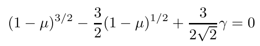
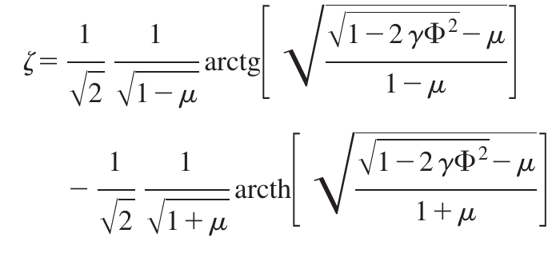

## Where does the NPSE collapse?
We compute the chemical potential of the solitonic solution using 

for various values of $\gamma$.
Then, we can invert the implicit relation

and find the soliton shape.
